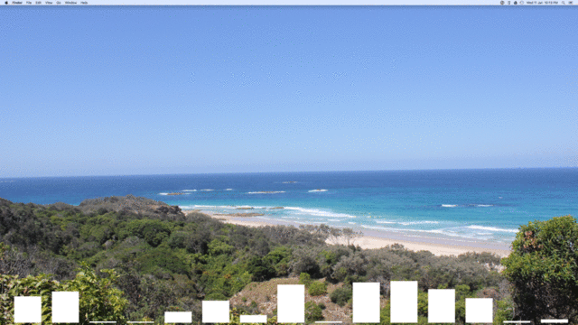

# Stravasicht

Stravasicht is a simple widget for Übersicht that tracks your Strava progress throughout the year. As the .gif illustrates as your days progress a new bar is added for each one. The widget supports a choice of custom color and various metrics including distance, elapsed time and max speed.

## Getting Started
You will need an access token for the widget to be able to access the Strava API.
This can be obtained at https://www.strava.com/settings/api
